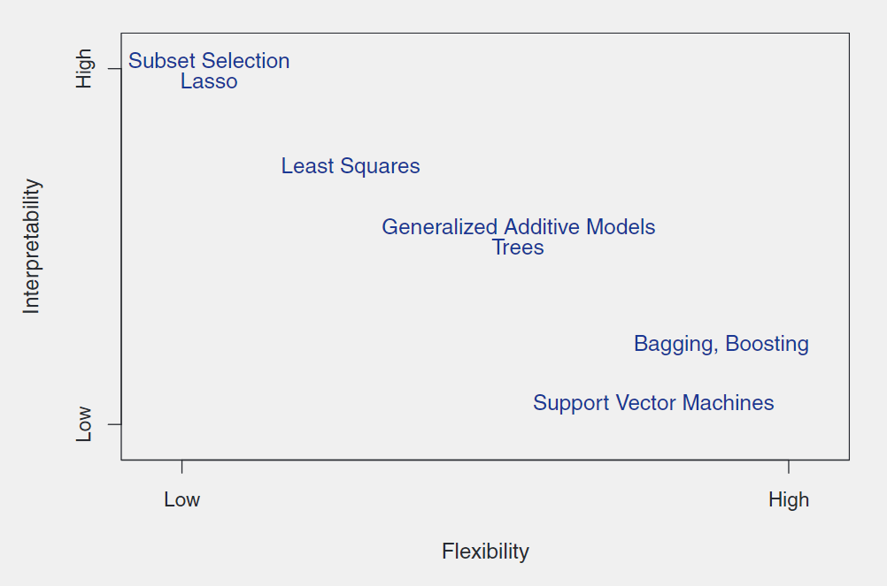
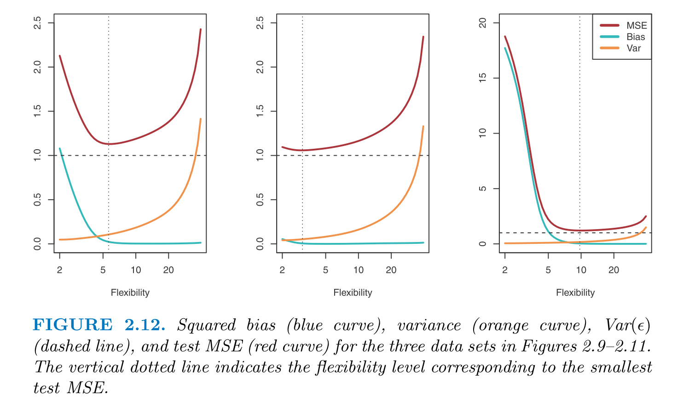

```{r, include=F}
library(ISLR)
library(tidyverse)
library(knitr)
library(kableExtra)
```

## Notes

Broadly speaking, statistical models describe relationships between predictors and responses. A general equation describing this relationship is shown below:
$$Y = f(X) + \epsilon$$
where $X$ is the predictor, $f$ is a function, $\epsilon$ is a random error term independent of $X$ and with a mean of 0, and $Y$ is the response. In real life, we usually have to deal with often not having one or more of these terms available and have to estimate them, so the model looks more like:
$$\hat{Y} = \hat{f}(X) + \epsilon$$
which is the same but using estimates of the true values.

### Prediction vs. Inference

Depending on your goals, you may want emphasize estimating either $Y$ or $f$ with high fidelity. If you care more about predicting a response from predictors, and don't really care as much about what happens when predictors are manipulated, then you will use a predictive model. Here, $\hat{f}$ can be treated as a black box. I think this is when most machine learning techniques are used, but I'm not sure.

Inferential models place more of an emphasis on understanding the way that $Y$ is affected as predictors change. In these models, $f$ can't be treated as a black box. There are three main reasons you'd want to use an inferential model:

1. Figuring out which predictors are important for predicting $Y$.
2. Figuring out what the relationship is between each predictor and $Y$.
3. Figuring out if a simple linear model is adquate to explain the relationship between $X$ and $Y$, or if a more complicated model is needed.

### Parametric vs. Non-parametric Models

Parametric methods assume that $f$ takes a certain form. For instance, linear models assume that $f$ takes the form: 
$$Y = \beta_0 + \beta_1 X_1 + ... + \beta_p X_p$$
Once the form of the model is chosen, the *parameters* of the model must then be fit. Parametric modeling thus reduces the problem of estimating $f$ down to the problem of fitting the parameters of whatever model you choose, rather than having estimate $f$ from all possible functions. However, if the actual form of $f$ is too far from the $\hat{f}$ you've chosen, you won't model the data very well. Flexible models, which can assum a wide variety of forms, can help account for this, though with some caveats.

Non-parametric models do not make assumption about what form $f$ will take. This allows them to more closely fit a wide range of possible distributions, and avoids the risk that parametric models take that the actual form of $f$ will differ widely from the form of $f$ that is chosen to model the data. A downside to non-parametric models is that they require a large number of observations to avoid overfitting data.

### Prediction Accuracy vs. Model Interpretability

In general, the more accurately models predict data, the less interpretable they are. Going back to prediction vs. inference, this means that models chosen for prediction will be less interpretable than models chose for inference.



### Supervised vs. Unsupervised Learning

Supervised models have a response for each observation, in contrast to unsupervised models. With unsupervised models, you are instead looking to group your observations into clusters to possibly discern meaningful clusters or groups. An example of unsupervised modeling is principle component analysis.

###Assessing Model Accuracy

When comparing the relative usefulness of different models, a method must be developed to assess model accuracy. The most popular method to measure how close a model's predicted responses ($\hat{y_i}$) are to the true responses ($y_i$) in the regression setting is to use the Mean Squared Error, defined as:

$$MSE = \frac{1}{n}\sum_{i = n}^{n}(y_i - \hat{f}(x_i))^2$$

The trick is not to minimize the MSE for the data used to create the model (training data), but rather to minimize the MSE for new data (test data). This introduces an interesting problem for model design. Intricate, highly flexible models can be designed to minimuze the MSE in training data, but all relationships between predictors and responses are comprised of both the function and irreducible error. If these models are fit too closely to the training data, then the models will be fit to the idiosyncratic, non-predictive irredicible error of the training data, which could then lower the model accuracy on test data. This is referred to as overfitting the data. In other words, you want your model $\hat{f}(x)$ to be close to $f(x)$ but not ${f}(x) + \epsilon_{training}$. 

### Bias vs. Variance Trade-off

Bias and variance of models are the two components of a model that limit model accuracy (in addition to random error). Variance refers to the amount by which $\hat{f}$ would change if we estimated it using a di???erent training data set. Ideally, $\hat{f}$ should not change too much if we estimated it using different training sets. In general, more flexible models have higher variance. Bias refers to error introduced by approximating a complicated real-life problem with a much simpler model. For instance, estimating a highly non-linear relationship with a linear model will always have substantial error, regardless of how many data points there are. In general, as bias increases, variance decreases, and vice-versa. However, the do not always increase or decrease at the same rate, so to get the most accurate model, you have to monitor this trade-off. Usually, squared bias decreases faster than variance increases, then as flexibility increases further, variance increases faster than bias. Generally, more flexible models will have higher variance and lower bias.



###Classification

If $y$ is categorical rather than numerical, classification can be used instead of regression (although logistic regression can still be used). Classification uses many of the same principles as regression for estimating model accuracy. The goal is to correctly classify test data at the highest rate possible. The test error rate is evaluated as follows, where $I$ is an indicator function that equals 1 if $y_0 = \hat{y}_0$ and equals 0 if not. So the higher the proportion of test observations are missclassified, the higher the test error rate is and vice versa.

$$ E_{test} = \frac{1}{n} \sum_{i=n}^n I(y_0 \neq \hat{y}_0) $$

### Exercises

**1)** For each of parts (a) through (d), indicate whether we would generally expect the performance of a flexible statistical learning method to be better or worse than an inflexible method. Justify your answer. 

(a) The sample size n is extremely large, and the number of predic-tors p is small.

Flexible is better. With a high number of observations, we can expect that the distribution of the data is governed by $f$ than $\epsilon$, so a flexible model that follows tha shape of the data can be expected to closely estimate the form of $f$.

(b) The number of predictors p is extremely large, and the number of observations n is small. 

Flexible is worse. With a low number of observations, more flexibility in a model can lead to overfitting. 

(c) The relationship between the predictors and response is highly non-linear. 

Flexible is better, as the model can fit to unusually shaped data better.

(d) The variance of the error terms, i.e. $\sigma^2 = VAR(\epsilon)$, is extremely high. 

Flexible is worse, as a higher error variance can more easily lead to overplotting with flexible models.

**2)** Explain whether each scenario is a classification or regression problem, and indicate whether we are most interested in inference or prediction. Finally, provide n and p. 

(a) We collect a set of data on the top 500 firms in the US. For each firm we record profit, number of employees, industry and the CEO salary. We are interested in understanding which factors affect CEO salary. 

Regression: trying to predict quantitative variable of CEO salary. Inference - want to know which factors are important.  
n = 500, p = profit, number of employees, industry

(b) We are considering launching a new product and wish to know whether it will be a success or a failure. We collect data on 20 similar products that were previously launched. For each prod-uct we have recorded whether it was a success or failure, price charged for the product, marketing budget, competition price, and ten other variables.

Classification - categories are "success" and "failure." Prediction - want to be able to predict success or failure of product.  
n = 20, p = price, marketing budget, competition price, and ten other variables

(c) We are interest in predicting the % change in the USD/Euro exchange rate in relation to the weekly changes in the world stock markets. Hence we collect weekly data for all of 2012. For each week we record the % change in the USD/Euro, the % change in the US market, the % change in the British market, and the % change in the German market.

Regression - percent chane in value is quantitative. Prediction - want to predict change.  
n = 52, p = US, British, and German market % changes


**3)** We now revisit the bias-variance decomposition. 

(a) Provide a sketch of typical (squared) bias, variance, training er-ror, test error, and Bayes (or irreducible) error curves, on a sin-gle plot, as we go from less flexible statistical learning methods towards more flexible approaches. The x-axis should represent the amount of flexibility in the method, and they-axis should represent the values for each curve. There should be five curves. Make sure to label each one. 


(b) Explain why each of the five curves has the shape displayed in part (a). 

**4.** You will now think of some real-life applications for statistical learn-ing. 

(a) Describe three real-life applications in which classification might be useful. Describe the response, as well as the predictors. Is the goal of each application inference or prediction? Explain your answer. 

1. Case/control GWAS. Predictors are SNPs and covariates. Purpose is inference - want to know which SNPs are associated with outcome.
2. Predicting whether a client will default on a loan or not. Purpose is prediction. Predictor is various demographic factors, response is pay/default.
3. Classifying cancers based on blood biomarkers. Purpose could be either - want to predict whether someone has cancer or not, but could be inferential if you're trying to figure out which biomarkers are associated with cancer. Response is either cancerous/non-cancerous.


(b) Describe three real-life applications in which regression might be useful. Describe the response, as well as the predictors. Is the goal of each application inference or prediction? Explain your answer. 

1. Effect of a drug on the size of a tumor (sorry most of these are related to medicine -- I'm in medical school). Predictor is drug dose administered. Response is tumor size. Purpose probably inferential, since you're trying to discern the effect of the drug on tumor size.
2. Predict how tall a child will be when they are an adult based on current height, parent height, nutrition, etc. Purpose is prediction.
3. Predicting teams' records in the NFL for the upcoming season based on past performance, current roster, etc. Purpose is prediction.

(c) Describe three real-life applications in which cluster analysis might be useful. 

1. PCA to help identify population stratification in GWAS. 
2. Grouping shoppers by basic demographics to see if that identifies shopping trends.
3. PCA of mRNA expression on cancer cells to identify cancer cell lines.

**5)** What are the advantages and disadvantages of a very flexible (versus a less flexible) approach for regression or classification? Under what circumstances might a more flexible approach be preferred to a less flexible approach? When might a less flexible approach be preferred? 

In general, flexible approaches are better the less you know about the form of $f$ going into the analysis (put alternatively, the more uniform your prior of $f$ is over the distribution of possible functions). It is better if you care about reducing bias in your model. The circumstances that determine whether you want a more flexible model depends partially on what question you're asking. If you want to know something very basic, such as whether or not a varying a predictor tends to increase or decrease the response, then a less flexible linear model can probably answer your question without much hassble. If you're dealing with a highly non-linear relationship between predictor and response, and you have a lot of observations, then a flexible model is probably better.

**6.** Describe the differences between a parametric and a non-parametric statistical learning approach. What are the advantages of a parametric approach to regression or classification (as opposed to a non-parametric approach)? What are its disadvantages? 

See my notes above on the topic.

**7.** The table below provides a training data set containing six observa-tions, three predictors, and one qualitative response variable. 

```{r,echo=F}
p <- tibble(Obs. = 1:6, X1 = c(0,2,0,0,-1,1), X2 = c(3,0,1,1,0,1), X3 = c(0,0,3,2,1,1), Y = c("Red", "Red", "Red", "Green", "Green", "Red"))

p %>%
  kable() %>%
  kableExtra::kable_styling(bootstrap_options = c("striped", "hover", "responsive"), full_width = F)

```

Suppose we wish to use this data set to make a prediction forYwhen X1=X2=X3= 0 usingK-nearest neighbors. 

(a) Compute the Euclidean distance between each observation and the test point, X1=X2=X3=0. 

```{r, echo=F}

p %>% mutate(
  Dist = (X1^2 + X2^2 + X3^2)^(1/2)
  ) %>%
  kable() %>%
  kableExtra::kable_styling(bootstrap_options = c("striped", "hover", "responsive"), full_width = F)

```


(b) What is our prediction with K =1? Why?

Green, because the nearest observation (5) is labeled green.

(c) What is our prediction with K =3? Why? 

Red, because 2 of the 3 closest observations are labeled Red.

(d) If the Bayes decision boundary in this problem is highly non-linear, then would we expect the best value for K to be large or small? Why? 

Small, because the decision boundary could shift very suddenly, making the predictive value of points drop precipitously the further away they are.


___